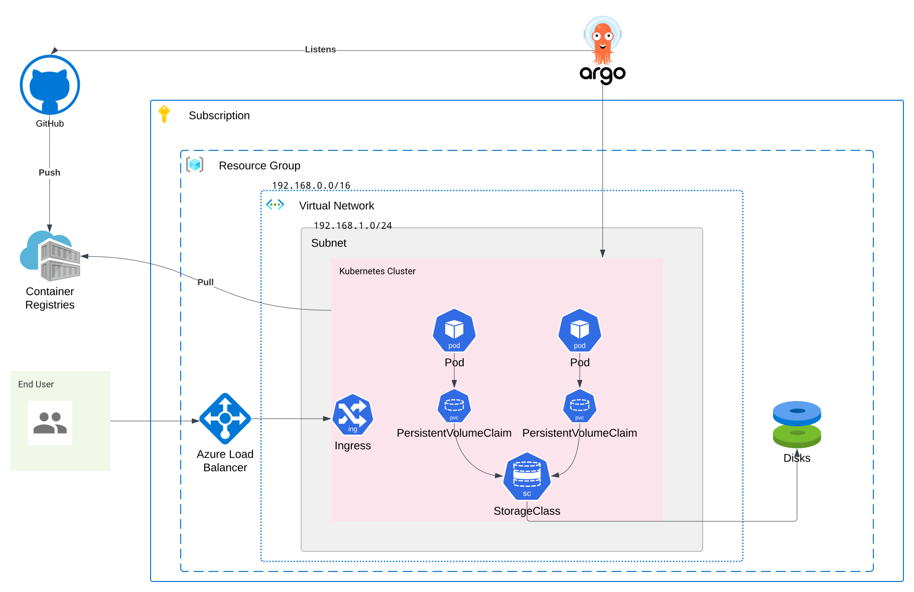

# WordPress on AKS Cluster


A project demonstrating how to deploy a WordPress site on an Azure Kubernetes Service (AKS) cluster using Kubernetes manifests, Helm, and persistent storage. This project showcases best practices for cloud-native application deployment.

## Table of Contents
1. [Overview](#Overview)
2. [Tech Stack](#Tech-Stack)
3. [Architecture](#Architecture)
4. [Prerequisites](#Prerequisites)
5. [Setup Instructions](#Setup-Instructions)
6. [Project Highlights](#Project-Highlights)
7. [Contributing](#Contributing)
8. [Issues](#Issues)
9. [License](#License)


## Overview
This project automates the deployment of a WordPress website on Azure Kubernetes Service (AKS). It includes features such as:

Persistent storage for WordPress data.
Configurable scalability using Kubernetes.
Customizable environment through Helm values.


## Tech Stack
- Azure Kubernetes Service (AKS): For managed Kubernetes clusters.
- Kustomize: To manage application environments.
- PersistentVolume (PV): For durable storage.
- Terraform: For infrastructure provisioning.
- ArgoCD: To automate application deployment and management.


## Architecture

This architecture consists of:

1. WordPress Pod: Runs the WordPress application.
2. PersistentVolume (Azure Disk): Ensures data persists even if the pod restarts.
3. AKS Cluster: Hosts the application.
4. LoadBalancer Service: Exposes WordPress to the internet.


## Prerequisites
Before deploying this project, ensure the following are installed and configured:

Terraform
kubectl
An Azure account


## Setup Instructions
1. Clone the repository:
    ```bash
    git clone https://github.com/Ahmedelsa3eed/Wordpress_AKS_Cluster.git
    cd Wordpress_AKS_Cluster
    ```

2. Create an Active Directory service principal account
    ```bash
    az ad sp create-for-rbac --skip-assignment
    ```

3. Put the generated `appId` and `password` at the terraform variables

4. Provision the infrastructure using terraform
    ```bash
    cd terraform
    terraform init
    terraform apply
    ```

5. Configure `kubectl`
    ```bash
    az aks get-credentials --resource-group $(terraform output -raw resource_group_name) --name $(terraform output -raw kubernetes_cluster_name)
    ```

6. Install Ingress
    ```bash
    kubectl apply -f https://raw.githubusercontent.com/kubernetes/ingress-nginx/controller-v1.10.4/deploy/static/provider/cloud/deploy.yaml
    ```

7. Get the loadbalancer IP address to be used in Cloudflare
    ```bash
    kubectl get svc -n ingress-nginx
    ```

8. Install argocd
    ```bash
    kubectl create namespace argocd
    kubectl apply -n argocd -f https://raw.githubusercontent.com/argoproj/argo-cd/stable/manifests/install.yaml
    ```

9. Setup argocd
    ```bash
    kubectl apply -f argocd/ingress.yml
    ```

10. Create the `tls-secret` using one of the follwing methods:
    ```bash
    kubectl create -n argocd secret tls argocd-server-tls --cert=path/to/cert.pem --key=/path/to/key.pem
    ```
    or run ``kubectl apply -f argocd/tls-secret.yml`` on this file
    ```yml
    apiVersion: v1
    kind: Secret
    metadata:
      name: tls-secret
      namespace: argocd
    type: kubernetes.io/tls
    data:
      tls.crt: <base64-of-tls.crt>
      tls.key: <base64-of-tls.key>
    ```

11. Create an `A` record on Cloudflare such that saeed-argocd points at the loadbalancer IP address

12. Now argocd should open at https://saeed-argocd.cloud-stacks.com

13. Find the initial admin password using:
    ```bash
    argocd admin initial-password -n argocd
    ```

14. Configure argocd to connect to this repository

15. Create another `tls-secret` at the `dev` namespace
    ```yml
    apiVersion: v1
    kind: Secret
    metadata:
      name: tls-secret
      namespace: dev
    type: kubernetes.io/tls
    data:
      tls.crt: <base64-of-tls.crt>
      tls.key: <base64-of-tls.key>
    ```

16. Create an application that points at the path `overlays/dev`

17. Now you could open the wordpress application at https://saeed-wordpress.cloud-stacks.com

## Project Highlights
- **Scalability**: Utilizes Kubernetes for scaling pods.
- **Persistence**: Employs Azure Disk for data durability.
- **Modularity**: Uses Kustomize for flexible configuration.

## Contributing
Contributions are welcome! To contribute:

1. Fork the repository.
2. Create a feature branch:
    ```bash
    git checkout -b feature-branch-name
    ```
3. Commit your changes:
    ```bash
    git commit -m "Add a new feature"
    ```
4. Push to your fork and submit a pull request.

## Issues
If you encounter any problems, please [create an issue](https://github.com/Ahmedelsa3eed/Wordpress_AKS_Cluster/issues).

## License
This project is licensed under the MIT License. See the [LICENSE](https://github.com/Ahmedelsa3eed/Wordpress_AKS_Cluster/LICENSE) file for details.